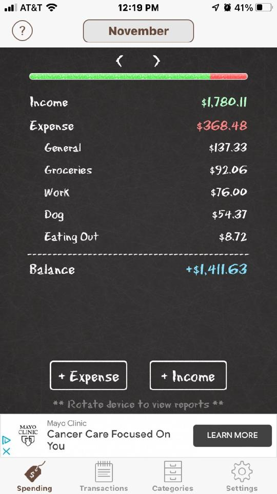

# Planning

## Budget app features
* Spending Tab
    * [ ] View month
    * [ ] Change month
    * [ ] < Month arrows >
    * [ ] ---Income/Expense bar---
    * [ ] Income total
    * [ ] Expense total
    * [ ] Expense breakdown
    * [ ] ---line break---
    * [ ] Add expense
    * [ ] Add income\

* Transactions
    * [ ] View month
    * [ ] Change month
    * [ ] < Month arrows >
    * [ ] Add
        * [ ] Expense
        * [ ] Add
    * [ ] Income total
    * [ ] Expense total
    * [ ] List view - category icon
    * [ ] List view
    * [ ] List view - click to edit item\

* Category
    * [ ] Category toggle (Expense | Income)
    * [ ] List view - icon
    * [ ] List view 
    * [ ] List View - click to edit item\

* Cashflow visual
    * [ ] Visual - legend
    * [ ] Visual
    * [ ] < Month/Year toggle >
    * [ ] To category visual\
\
* Categories visual
    * [ ] Visual - legend
    * [ ] Visual - (+income/-expense) toggle ***stretch***
    * [ ] Visual - UOM toggle
    * [ ] Visual - Pie
    * [ ] Visual - Bar 
    * [ ] Visual - view toggle
    * [ ] < Month/Year toggle >
    * [ ] To category visual\

## Other Todo
* [ ] UpdateDev settings
    * [ ] Setup terminal
        * [ ] Alias
        * [ ] git settings
        * [ ] git ui stuff ( directory > branch > status)
* [ ] Organize Bookmarks
* [ ] 